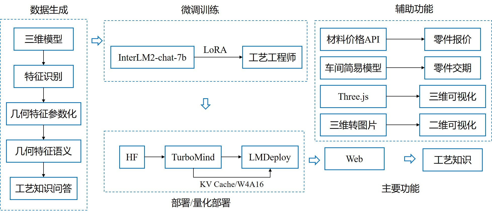

# InterLMProcesser
## 基于InternLM的工艺工程师助手项目 #1582
基于InternLM的工艺工程师助手项目，欢迎大家也来参加书生大模型实战营项目（http://github.com/internLM/tutorial）

### 项目背景：
加工机械零件和进行报价需要深厚的工艺知识。一个合格的工艺工程师不仅需要经过长时间的培训，还需要丰富的实操经验。为了提升工艺工程师的专业能力，我们利用InternLM2大模型及微调开发了一个工艺知识查询助手InternProcesser。InterProcesser还整合历史报价数据库，能够自动为零件报价。用户可以通过配置车间生产模拟器，用InterProcess预测交货时间，并对生产能力进行预警。

### 技术路线：


### prompt
基于[langGPT](https://github.com/langgptai/LangGPT)的prompt工程，我们设计了工艺工程师助理的[prompt](./prompt/process_lang.txt)

### 数据集
#### 自我认识
创建了自我认识[数据格式](./dataset/self.json)，用于训练InternLM模型，使其能够更好地理解工艺工程师的角色和职责。
创建了常用的问题和回答[案例](./dataset/common.json)。可以用于微调模型的测试集合
### 微调数据集
我们将机械零件分类为铣削零件、车削零件和钣金零件。如果不属于这些类别，则统一归为机械零件。
每个案例包含两轮对话。第一轮从我们的工艺工程师的提示开始，描述零件的几何尺寸和特征分布，并询问如何加工。回答将从六个方面展开：几何形状分析、材料准备、机械加工、后处理、质量检测以及入库和发货。
在第二轮对话中，会提供零件的加工工时和体积，询问零件的报价。回答将包括详细的报价计算，涵盖机加工成本、材料费和利润等。

### 环境配置
初学者可以参考书生浦语训练营：第5关
[XTuner微调个人小助手认知](https://github.com/InternLM/Tutorial/tree/camp3/docs/L1/XTuner)
```
# 创建虚拟环境
conda create -n xtuner python=3.10 -y

# 激活虚拟环境（注意：后续的所有操作都需要在这个虚拟环境中进行）
conda activate xtuner

# 安装一些必要的库
conda install pytorch==2.1.2 torchvision==0.16.2 torchaudio==2.1.2 pytorch-cuda=12.1 -c pytorch -c nvidia -y
# 安装其他依赖
pip install transformers==4.39.3
pip install streamlit==1.36.0

git clone -b v0.1.21  https://github.com/InternLM/XTuner /root/InternLM/code/XTuner
pip install -e '.[deepspeed]'

```
### 微调训练
本项目尝试了在internlm2-chat-7b和internlm2-chat-1_8b的基础上微调训练，未来也将在internlm2-chat-20b上微调，但为了更方便的部署和使用，在线体验使用的是internlm2-chat-1_8b。
体验地址：[xopenlab](https://openxlab.org.cn/apps/detail/agem/InternProcesser)
```
xtuner train ./internlm2_chat_1_8b_qlora_alpaca_e3_copy.py

```
### 模型部署
本项目通过Streamlit 部署在网页端。
```
streamlit run ./chat_ui_demo.py
```


### 致谢
感谢上海人工智能实验室 书生·浦语大模型实战营 的 干货课程 和 算力支持！

ps：书生大模型实战营第三期已经开营，欢迎大家报名参加。

营长 @yanbo @闻星 @夂 等老师答疑超级有耐心、超级好
